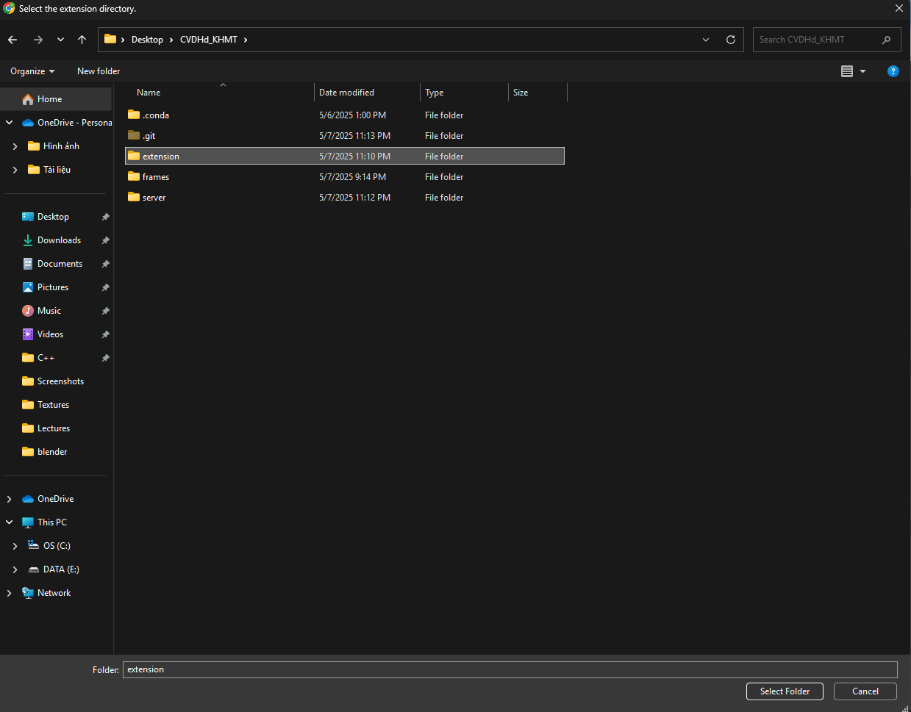

# test_cac_van_de_hien_dai

A chrome eye tracking extension

## Run Locally

Clone the project

```bash
  git clone https://github.com/LemonteaIsgood45/test_cac_van_de_hien_dai.git
```

Go to the project directory

```bash
  cd my-project
```

Install dependencies

```bash
  python -m venv venv
  source venv/bin/activate
  pip install -r requirements.txt
```

Start the server

```bash
  python server/server.py

```

## Deployment

To deploy this project, add extension to chrome.

Open "Manage extensions", turn on "Developer mode"





calibrate button is re-calibrate eye tracking, look at the blue circle to calibrate
